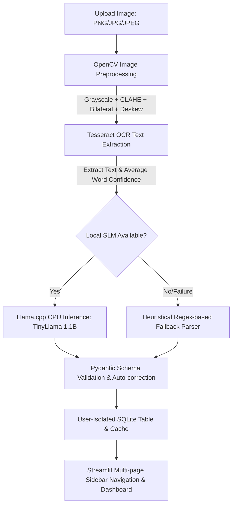

# Offline Business Card Scanner

An offline-first AI application that extracts information from business card images (JPG, JPEG, PNG) and converts them into structured JSON schemas. It features a local user authentication system, user-scoped data isolation in SQLite, and a multi-page professional dashboard.

This project requires **no external APIs** or cloud services (no Auth0, Supabase, Firebase, or OpenAI), making it highly secure, private, and 100% offline.

---

## 🎛️ Technology Stack

* **Frontend:** Streamlit (Custom responsive theme supporting Dark Glassmorphism and Classic Light styles)
* **Authentication:** Bcrypt password hashing
* **Image Preprocessing:** OpenCV (Rescaling, deskewing/rotation, grayscale, CLAHE contrast, bilateral filtering, adaptive binarization)
* **OCR Engine:** Tesseract OCR (via `pytesseract`)
* **Local SLM (Inference):** `llama-cpp-python` with quantized **TinyLlama 1.1B Chat GGUF** (CPU Optimized, no GPU required)
* **Database:** SQLite3
* **Performance Monitoring:** `psutil` (Tracks CPU & Memory usage)
* **Data Validation:** Pydantic (Type enforcement and missing field defaults)

---

## 🏗️ System Architecture & Workflow



1. **Authentication:** User logs in securely. Password hashes are verified locally using `bcrypt`.
2. **Preprocessing (OpenCV):** Image is upscaled if resolution is low, deskewed (rotated back using Tesseract OSD), grayscaled, contrast-stretched using CLAHE, filtered for grain using a bilateral filter, and binarized using adaptive thresholding.
3. **OCR (Tesseract):** Extracted text and average word confidence are computed.
4. **Local AI Parsing (llama.cpp):** TinyLlama 1.1B processes the OCR text and transforms it into structured JSON. If the model file is not present or fails, a regex-based parser extracts emails, websites, phones, names, titles, and companies as a fallback.
5. **Validation:** Pydantic validates the JSON structure against the required schema, and auto-corrects malformed LLM outputs (resolving single/double quotes, trailing commas, missing keys).
6. **SQLite Storage & Isolation:** Verified data, upload timestamp, original image, and performance metrics are saved in SQLite. Data is isolated by `user_id` so that users can only see, search, or edit their own cards.
7. **Cache & Settings:** Cached JSON loads identical card uploads immediately. Caching behaviors (OCR/AI cache toggles) can be cleared or adjusted in settings.

---

## 📁 Project Structure

```
offline_business_card_scanner/
│
├── app.py                  # Main Streamlit router (checks sessions and switches pages)
├── requirements.txt        # Python library dependencies (includes bcrypt)
├── README.md               # Overall documentation
├── .env.example            # Environment configurations template
├── .env                    # Active local environment variables
│
├── auth/
│   ├── security.py         # Bcrypt password hashing and input sanitization
│   ├── session.py          # Session variables setup, timeout constraints
│   ├── login.py            # Streamlit login form
│   └── register.py         # Streamlit registration form
│
├── dashboard/
│   ├── dashboard.py        # Landing page with KPI stats, quick actions, and recent activity
│   └── analytics.py        # Scans count charts, average times, and common companies graphs
│
├── contacts/
│   └── contacts_manager.py # Saved contacts management (pagination, grid/table toggle, sorting, edits, deletes)
│
├── user_profile/
│   └── profile.py          # Profile info viewing, email updates, and password changes
│
├── settings/
│   └── settings.py         # Theme selectors, export paths, cache control, and DB backup/restore
│
├── ocr/
│   └── extractor.py        # OpenCV enhancement pipeline and Tesseract OCR
│
├── llm/
│   └── parser.py           # llama.cpp model loading, prompt builder, regex fallback
│
├── db/
│   └── sqlite_db.py        # SQLite database schemas, user CRUD, user stats, and migrations
│
├── utils/
│   ├── config.py           # App paths configuration and model downloader
│   ├── validators.py       # Pydantic schema validation & auto-correction rules
│   ├── logger.py           # Unified stdout and file logging configuration
│   └── performance.py      # Execution block timer and CPU/RAM monitor
│
├── tests/
│   └── test_scanner.py     # Automated unit test suite (database, validators, regex, auth)
└── sample_cards/           # Directory containing generated card images for testing
```

---

## 📥 Installation

### Prerequisites
* **Python 3.11 - 3.13** installed.
* **Tesseract OCR:** Must be installed on your OS.
  * **Windows:** Double-click the installer file `tesseract-setup.exe` present in your project root folder and follow the wizard to install Tesseract in `C:\Program Files\Tesseract-OCR`.

### Setup Instructions

1. Install dependencies:
   ```powershell
   pip install -r requirements.txt --extra-index-url https://abetlen.github.io/llama-cpp-python/whl/cpu
   ```
2. Copy the `.env.example` file to `.env`:
   ```powershell
   copy .env.example .env
   ```

---

## 🚀 Running the Application

1. To launch the interactive dashboard, run:
   ```bash
   streamlit run app.py
   ```
2. Open `http://localhost:8501` in your browser.
3. **Register/Login:** Switch the segmented switch to "Create Account" and sign up. You will be automatically logged in and redirected to the Dashboard.
4. **Dashboard:** See your KPI cards, quick actions, recent activity, and history.
5. **Scan Cards:** Go to the sidebar, select **📤 Scan Business Card**, upload a card from `sample_cards/`, check fields, and click **Save Contact to Database**.
6. **Manage Saved Cards:** Go to **📋 Saved Contacts** to browse in a tabular paginated layout, toggle to card view, filter by company/designation, edit contact details, delete records, or export/copy JSON.
7. **Analytics:** View **📈 Analytics** for line/bar charts of scanning counts and processing logs.
8. **Settings:** Toggle between "Dark Glassmorphism" and "Light Theme", clear caches, backup/restore SQLite database files.

---

## 🧪 Automated Testing

To run the updated test suite verifying registration checks, bcrypt operations, and data isolation logic:
```bash
python -m unittest tests/test_scanner.py
```
All 13 tests should return `OK`.
