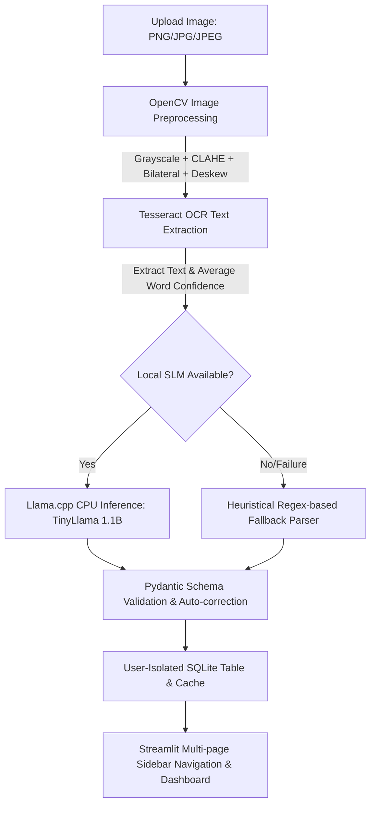

# Offline Business Card Scanner

<<<<<<< HEAD
An offline-first AI application that extracts information from business card images (JPG, JPEG, PNG) and converts them into structured JSON schemas. It features a local user authentication system, user-scoped data isolation in SQLite, and a multi-page professional dashboard.

This project requires **no external APIs** or cloud services (no Auth0, Supabase, Firebase, or OpenAI), making it highly secure, private, and 100% offline.

---

## 🎛️ Technology Stack

* **Frontend:** Streamlit (Custom responsive theme supporting Dark Glassmorphism and Classic Light styles)
* **Authentication:** Bcrypt password hashing
* **Image Preprocessing:** OpenCV (Rescaling, deskewing/rotation, grayscale, CLAHE contrast, bilateral filtering, adaptive binarization)
* **OCR Engine:** Tesseract OCR (via `pytesseract`)
* **Local SLM (Inference):** `llama-cpp-python` with quantized **TinyLlama 1.1B Chat GGUF** (CPU Optimized, no GPU required)
* **Database:** SQLite3
* **Performance Monitoring:** `psutil` (Tracks CPU & Memory usage)
* **Data Validation:** Pydantic (Type enforcement and missing field defaults)

---

## 🏗️ System Architecture & Workflow



1. **Authentication:** User logs in securely. Password hashes are verified locally using `bcrypt`.
2. **Preprocessing (OpenCV):** Image is upscaled if resolution is low, deskewed (rotated back using Tesseract OSD), grayscaled, contrast-stretched using CLAHE, filtered for grain using a bilateral filter, and binarized using adaptive thresholding.
3. **OCR (Tesseract):** Extracted text and average word confidence are computed.
4. **Local AI Parsing (llama.cpp):** TinyLlama 1.1B processes the OCR text and transforms it into structured JSON. If the model file is not present or fails, a regex-based parser extracts emails, websites, phones, names, titles, and companies as a fallback.
5. **Validation:** Pydantic validates the JSON structure against the required schema, and auto-corrects malformed LLM outputs (resolving single/double quotes, trailing commas, missing keys).
6. **SQLite Storage & Isolation:** Verified data, upload timestamp, original image, and performance metrics are saved in SQLite. Data is isolated by `user_id` so that users can only see, search, or edit their own cards.
7. **Cache & Settings:** Cached JSON loads identical card uploads immediately. Caching behaviors (OCR/AI cache toggles) can be cleared or adjusted in settings.

---

## 📁 Project Structure

```
offline_business_card_scanner/
│
├── app.py                  # Main Streamlit router (checks sessions and switches pages)
├── requirements.txt        # Python library dependencies (includes bcrypt)
├── README.md               # Overall documentation
├── .env.example            # Environment configurations template
├── .env                    # Active local environment variables
│
├── auth/
│   ├── security.py         # Bcrypt password hashing and input sanitization
│   ├── session.py          # Session variables setup, timeout constraints
│   ├── login.py            # Streamlit login form
│   └── register.py         # Streamlit registration form
│
├── dashboard/
│   ├── dashboard.py        # Landing page with KPI stats, quick actions, and recent activity
│   └── analytics.py        # Scans count charts, average times, and common companies graphs
│
├── contacts/
│   └── contacts_manager.py # Saved contacts management (pagination, grid/table toggle, sorting, edits, deletes)
│
├── user_profile/
│   └── profile.py          # Profile info viewing, email updates, and password changes
│
├── settings/
│   └── settings.py         # Theme selectors, export paths, cache control, and DB backup/restore
│
├── ocr/
│   └── extractor.py        # OpenCV enhancement pipeline and Tesseract OCR
│
├── llm/
│   └── parser.py           # llama.cpp model loading, prompt builder, regex fallback
│
├── db/
│   └── sqlite_db.py        # SQLite database schemas, user CRUD, user stats, and migrations
│
├── utils/
│   ├── config.py           # App paths configuration and model downloader
│   ├── validators.py       # Pydantic schema validation & auto-correction rules
│   ├── logger.py           # Unified stdout and file logging configuration
│   └── performance.py      # Execution block timer and CPU/RAM monitor
│
├── tests/
│   └── test_scanner.py     # Automated unit test suite (database, validators, regex, auth)
└── sample_cards/           # Directory containing generated card images for testing
```

---

## 📥 Installation

### Prerequisites
* **Python 3.11 - 3.13** installed.
* **Tesseract OCR:** Must be installed on your OS.
  * **Windows:** Double-click the installer file `tesseract-setup.exe` present in your project root folder and follow the wizard to install Tesseract in `C:\Program Files\Tesseract-OCR`.

### Setup Instructions

1. Install dependencies:
   ```powershell
   pip install -r requirements.txt --extra-index-url https://abetlen.github.io/llama-cpp-python/whl/cpu
   ```
2. Copy the `.env.example` file to `.env`:
   ```powershell
   copy .env.example .env
   ```

---

## 🚀 Running the Application

1. To launch the interactive dashboard, run:
   ```bash
   streamlit run app.py
   ```
2. Open `http://localhost:8501` in your browser.
3. **Register/Login:** Switch the segmented switch to "Create Account" and sign up. You will be automatically logged in and redirected to the Dashboard.
4. **Dashboard:** See your KPI cards, quick actions, recent activity, and history.
5. **Scan Cards:** Go to the sidebar, select **📤 Scan Business Card**, upload a card from `sample_cards/`, check fields, and click **Save Contact to Database**.
6. **Manage Saved Cards:** Go to **📋 Saved Contacts** to browse in a tabular paginated layout, toggle to card view, filter by company/designation, edit contact details, delete records, or export/copy JSON.
7. **Analytics:** View **📈 Analytics** for line/bar charts of scanning counts and processing logs.
8. **Settings:** Toggle between "Dark Glassmorphism" and "Light Theme", clear caches, backup/restore SQLite database files.

---

## 🧪 Automated Testing

To run the updated test suite verifying registration checks, bcrypt operations, and data isolation logic:
```bash
python -m unittest tests/test_scanner.py
```
All 13 tests should return `OK`.
=======


## Getting started

To make it easy for you to get started with GitLab, here's a list of recommended next steps.

Already a pro? Just edit this README.md and make it your own. Want to make it easy? [Use the template at the bottom](#editing-this-readme)!

## Add your files

* [Create](https://docs.gitlab.com/user/project/repository/web_editor/#create-a-file) or [upload](https://docs.gitlab.com/user/project/repository/web_editor/#upload-a-file) files
* [Add files using the command line](https://docs.gitlab.com/topics/git/add_files/#add-files-to-a-git-repository) or push an existing Git repository with the following command:

```
cd existing_repo
git remote add origin https://code.swecha.org/poojareddylankala13/offline-business-card-scanner.git
git branch -M main
git push -uf origin main
```

## Integrate with your tools

* [Set up project integrations](https://code.swecha.org/poojareddylankala13/offline-business-card-scanner/-/settings/integrations)

## Collaborate with your team

* [Invite team members and collaborators](https://docs.gitlab.com/user/project/members/)
* [Create a new merge request](https://docs.gitlab.com/user/project/merge_requests/creating_merge_requests/)
* [Automatically close issues from merge requests](https://docs.gitlab.com/user/project/issues/managing_issues/#closing-issues-automatically)
* [Enable merge request approvals](https://docs.gitlab.com/user/project/merge_requests/approvals/)
* [Set auto-merge](https://docs.gitlab.com/user/project/merge_requests/auto_merge/)

## Test and Deploy

Use the built-in continuous integration in GitLab.

* [Get started with GitLab CI/CD](https://docs.gitlab.com/ci/quick_start/)
* [Analyze your code for known vulnerabilities with Static Application Security Testing (SAST)](https://docs.gitlab.com/user/application_security/sast/)
* [Deploy to Kubernetes, Amazon EC2, or Amazon ECS using Auto Deploy](https://docs.gitlab.com/topics/autodevops/requirements/)
* [Use pull-based deployments for improved Kubernetes management](https://docs.gitlab.com/user/clusters/agent/)
* [Set up protected environments](https://docs.gitlab.com/ci/environments/protected_environments/)

***

# Editing this README

When you're ready to make this README your own, just edit this file and use the handy template below (or feel free to structure it however you want - this is just a starting point!). Thanks to [makeareadme.com](https://www.makeareadme.com/) for this template.

## Suggestions for a good README

Every project is different, so consider which of these sections apply to yours. The sections used in the template are suggestions for most open source projects. Also keep in mind that while a README can be too long and detailed, too long is better than too short. If you think your README is too long, consider utilizing another form of documentation rather than cutting out information.

## Name
Choose a self-explaining name for your project.

## Description
Let people know what your project can do specifically. Provide context and add a link to any reference visitors might be unfamiliar with. A list of Features or a Background subsection can also be added here. If there are alternatives to your project, this is a good place to list differentiating factors.

## Badges
On some READMEs, you may see small images that convey metadata, such as whether or not all the tests are passing for the project. You can use Shields to add some to your README. Many services also have instructions for adding a badge.

## Visuals
Depending on what you are making, it can be a good idea to include screenshots or even a video (you'll frequently see GIFs rather than actual videos). Tools like ttygif can help, but check out Asciinema for a more sophisticated method.

## Installation
Within a particular ecosystem, there may be a common way of installing things, such as using Yarn, NuGet, or Homebrew. However, consider the possibility that whoever is reading your README is a novice and would like more guidance. Listing specific steps helps remove ambiguity and gets people to using your project as quickly as possible. If it only runs in a specific context like a particular programming language version or operating system or has dependencies that have to be installed manually, also add a Requirements subsection.

## Usage
Use examples liberally, and show the expected output if you can. It's helpful to have inline the smallest example of usage that you can demonstrate, while providing links to more sophisticated examples if they are too long to reasonably include in the README.

## Support
Tell people where they can go to for help. It can be any combination of an issue tracker, a chat room, an email address, etc.

## Roadmap
If you have ideas for releases in the future, it is a good idea to list them in the README.

## Contributing
State if you are open to contributions and what your requirements are for accepting them.

For people who want to make changes to your project, it's helpful to have some documentation on how to get started. Perhaps there is a script that they should run or some environment variables that they need to set. Make these steps explicit. These instructions could also be useful to your future self.

You can also document commands to lint the code or run tests. These steps help to ensure high code quality and reduce the likelihood that the changes inadvertently break something. Having instructions for running tests is especially helpful if it requires external setup, such as starting a Selenium server for testing in a browser.

## Authors and acknowledgment
Show your appreciation to those who have contributed to the project.

## License
For open source projects, say how it is licensed.

## Project status
If you have run out of energy or time for your project, put a note at the top of the README saying that development has slowed down or stopped completely. Someone may choose to fork your project or volunteer to step in as a maintainer or owner, allowing your project to keep going. You can also make an explicit request for maintainers.
>>>>>>> 226733a799420b36fabbf7ed448ea4d9084b7c5f
